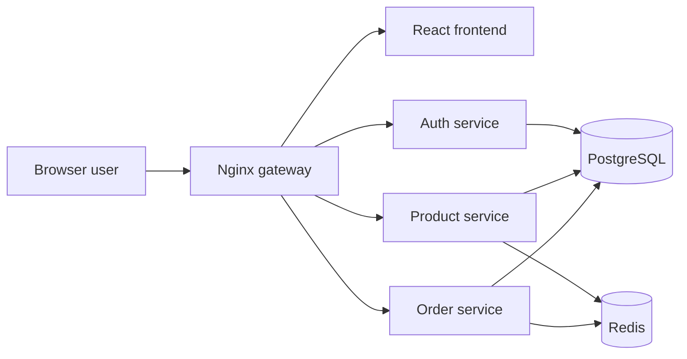

# Complete Microservice DevOps Project Guide

This repo is a single, step-by-step workbook for building and deploying a microservice project.

Everything now lives in one workbook path. Follow the phases in order. Each phase tells you what to build, which commands to run, how to verify the result, when to commit, and where to go next.

Start here:

[step-by-step-guide/00-start-here.md](step-by-step-guide/00-start-here.md)

## What You Will Build

You will build one complete DevOps project:

| Layer | Tool | Result |
| --- | --- | --- |
| Frontend | React | Browser UI for the app |
| API gateway | Nginx | One entry point for all browser and API traffic |
| Backend | Node.js and Express | Auth, product, and order microservices |
| Database | PostgreSQL | Persistent users, products, and orders |
| Cache | Redis | Fast product caching |
| Containers | Docker | Images for each app component |
| Local stack | Docker Compose | Full app running on your machine |
| API testing | Postman and Python | Manual and scripted API checks |
| Local orchestration | Docker Desktop Kubernetes | Kubernetes practice before cloud |
| CI/CD | GitHub Actions | Automated checks on every push |
| Cloud | AWS | ECR, ECS Fargate, RDS, ElastiCache, Secrets Manager, and cleanup |

## The One Path To Follow

Do these phases in order. Do not jump to AWS or Kubernetes before the local app works.

| Phase | Open | You finish with |
| --- | --- | --- |
| 0 | [Start Here](step-by-step-guide/00-start-here.md) | Clear rules for using the workbook |
| 1 | [Windows Prerequisites](step-by-step-guide/01-local-development/01-prerequisites.md) | Tools installed and verified |
| 2 | [Project Structure](step-by-step-guide/01-local-development/02-project-structure.md) | Project folders and root files created |
| 3 | [Auth Service](step-by-step-guide/01-local-development/03-auth-service.md) | First API running on port `3001` |
| 4 | [Product And Order Services](step-by-step-guide/01-local-development/04-product-and-order-services.md) | Three backend services running locally |
| 5 | [Frontend](step-by-step-guide/01-local-development/05-frontend.md) | React app running on port `5173` |
| 6 | [Dockerize Services](step-by-step-guide/02-containers/01-dockerize-services.md) | Docker images for services and frontend |
| 7 | [Docker Compose Stack](step-by-step-guide/02-containers/02-docker-compose-postgres-redis.md) | Full local stack with PostgreSQL and Redis |
| 8 | [Nginx Gateway](step-by-step-guide/02-containers/03-nginx-gateway.md) | App available through `localhost:8080` |
| 9 | [Local Dev Workflow](step-by-step-guide/02-containers/04-local-dev-workflow.md) | Logs, rebuilds, shells, and reset commands understood |
| 10 | [Database Integration](step-by-step-guide/02-containers/05-database-integration.md) | Services using PostgreSQL |
| 11 | [Redis Caching](step-by-step-guide/02-containers/06-redis-cache.md) | Product data cached in Redis |
| 12 | [Postman API Testing](step-by-step-guide/03-api-testing/01-postman-api-testing.md) | APIs tested one request at a time |
| 12B | [Python API Testing](step-by-step-guide/03-api-testing/02-python-api-testing.md) | Optional scripted API checks |
| 13 | [Enable Kubernetes](step-by-step-guide/04-kubernetes/01-docker-desktop-kubernetes.md) | `kubectl` connected to Docker Desktop |
| 14 | [Deploy To Local Kubernetes](step-by-step-guide/04-kubernetes/02-local-kubernetes-deployment.md) | Full stack running in local Kubernetes |
| 15 | [Git And GitHub](step-by-step-guide/05-ci-cd/01-git-github.md) | Project pushed to GitHub |
| 16 | [GitHub Actions CI](step-by-step-guide/05-ci-cd/02-github-actions-ci.md) | CI workflow running on push |
| 17 | [AWS Foundation](step-by-step-guide/06-aws/01-aws-foundation.md) | AWS CLI, identity, region, and budget ready |
| 18 | [ECR And ECS Fargate](step-by-step-guide/06-aws/02-ecr-and-ecs-fargate.md) | First container image pushed and deployed |
| 19 | [RDS, ElastiCache, And Secrets](step-by-step-guide/06-aws/03-rds-elasticache-secrets.md) | Cloud database, cache, and secrets path understood |
| 20 | [AWS Cleanup](step-by-step-guide/06-aws/04-cleanup.md) | Cloud resources deleted to stop cost |

## How Every Phase Works

Every phase uses the same pattern:

1. Read the goal.
2. Run the commands exactly from the folder shown.
3. Create or edit the files shown.
4. Verify the result before moving on.
5. Commit your work when the phase tells you to commit.
6. Open the next phase.

If verification fails, stop there and fix it before continuing.

## Architecture



Full architecture notes:

[step-by-step-guide/reference/architecture.md](step-by-step-guide/reference/architecture.md)

## Repo Layout

```text
.
|-- step-by-step-guide/
|   |-- 00-start-here.md
|   |-- 01-local-development/
|   |-- 02-containers/
|   |-- 03-api-testing/
|   |-- 04-kubernetes/
|   |-- 05-ci-cd/
|   |-- 06-aws/
|   `-- reference/
|
|-- kubernetes/
|   `-- local/
|
`-- templates/
    |-- aws/
    |-- github-actions/
    `-- python-api-tests/
```

## Quick Reference

Use these only when you need a lookup. The workbook path above is the main path.

| Need | Open |
| --- | --- |
| Commands | [Commands Cheat Sheet](step-by-step-guide/reference/commands-cheatsheet.md) |
| API list | [API Endpoints](step-by-step-guide/reference/api-endpoints.md) |
| Project folder map | [Project Folder Map](step-by-step-guide/reference/project-folder-map.md) |
| Progress tracking | [Progress Tracker](step-by-step-guide/reference/progress-tracker.md) |
| Study plan | [Study Plan](step-by-step-guide/reference/study-plan.md) |
| Environment variables | [Environment Variables](step-by-step-guide/reference/environment-variables.md) |
| Troubleshooting | [Troubleshooting](step-by-step-guide/reference/troubleshooting.md) |
| Terms | [Glossary](step-by-step-guide/reference/glossary.md) |
| Official docs | [Official Links](step-by-step-guide/reference/official-links.md) |

## Version Notes

This guide was prepared on May 26, 2026.

- Node.js examples use Node.js 24 LTS.
- Docker Compose commands use `docker compose`.
- AWS examples use AWS CLI v2.

If you read this much later, check the official docs before using the same versions in production.
