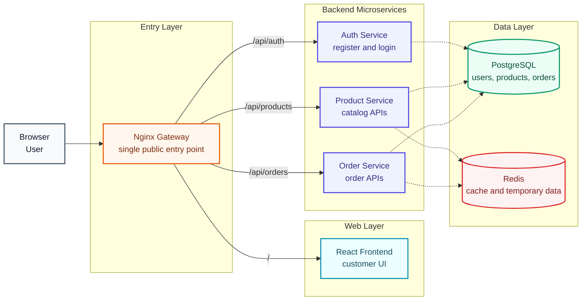

# 🚀 Complete Microservice DevOps Project Guide

Welcome to your **hands-on DevOps project reference**.

This repo is built for a beginner who wants to actually do the project, not just read theory.

You will build the project locally on Windows first, then add Docker, Postman API testing, local Kubernetes, CI/CD, and AWS step by step.

## 🧭 What Should I Do First?

Start here:

| Step | Open This | What You Do |
| --- | --- | --- |
| 1 | [Start Here](docs/00-start-here.md) | Understand how to use this repo |
| 2 | [Documentation Home](docs/README.md) | Follow the full learning path |
| 3 | [Hands-On Labs](hands-on/README.md) | Practice with real tasks |
| 4 | [Postman Tests](docs/03-api-testing/01-postman-api-testing.md) | Test one API at a time |
| 5 | [Troubleshooting](docs/reference/troubleshooting.md) | Fix common errors |

## 🎯 What You Will Build

You will build a real microservice DevOps project:

| Layer | Tool | What It Does |
| --- | --- | --- |
| Frontend | React | User interface |
| Gateway | Nginx | Single entry point for APIs |
| Backend | Node.js + Express | Auth, products, and orders |
| Database | PostgreSQL | Stores users, products, orders |
| Cache | Redis | Caches product data |
| Containers | Docker | Packages each service |
| Local Infra | Docker Compose | Runs the full stack locally |
| API Testing | Postman + Python | Tests APIs one endpoint at a time |
| Local Orchestration | Kubernetes in Docker Desktop | Tests deployment before cloud |
| CI/CD | GitHub Actions | Checks code and Docker builds |
| Cloud | AWS | ECR, ECS Fargate, RDS, ElastiCache, Secrets Manager |

## 🏗️ System Architecture



Detailed architecture:

[docs/reference/architecture.md](docs/reference/architecture.md)

## 🗂️ Repo Layout

```text
.
|-- docs/
|   |-- 00-start-here.md
|   |-- 01-local-development/
|   |-- 02-containers/
|   |-- 03-api-testing/
|   |-- 04-kubernetes/
|   |-- 05-ci-cd/
|   |-- 06-aws/
|   `-- reference/
|
|-- hands-on/
|   |-- 01-windows-setup-lab.md
|   |-- 02-build-first-microservice-lab.md
|   |-- 03-docker-compose-stack-lab.md
|   |-- 04-nginx-gateway-lab.md
|   |-- 05-database-and-cache-lab.md
|   |-- 06-postman-api-testing-lab.md
|   |-- 07-local-kubernetes-lab.md
|   |-- 08-ci-cd-lab.md
|   `-- 09-aws-first-deployment-lab.md
|
|-- kubernetes/
|   `-- local/
|
`-- templates/
    |-- aws/
    `-- github-actions/
```

## 📚 Learning Roadmap

Follow the phases in order.

| Phase | Guide | Practice |
| --- | --- | --- |
| 0 | [Start Here](docs/00-start-here.md) | Learn how to use the repo |
| 1 | [Windows Prerequisites](docs/01-local-development/01-prerequisites.md) | Install tools |
| 2 | [Project Structure](docs/01-local-development/02-project-structure.md) | Create folders |
| 3 | [Auth Service](docs/01-local-development/03-auth-service.md) | Build first API |
| 4 | [Product and Order Services](docs/01-local-development/04-product-and-order-services.md) | Add more APIs |
| 5 | [Frontend](docs/01-local-development/05-frontend.md) | Build React UI |
| 6 | [Dockerize Services](docs/02-containers/01-dockerize-services.md) | Build images |
| 7 | [Docker Compose](docs/02-containers/02-docker-compose-postgres-redis.md) | Run full stack |
| 8 | [Nginx Gateway](docs/02-containers/03-nginx-gateway.md) | Route through one URL |
| 9 | [Daily Docker Workflow](docs/02-containers/04-local-dev-workflow.md) | Use logs and debug commands |
| 10 | [Database Integration](docs/02-containers/05-database-integration.md) | Persist data |
| 11 | [Redis Caching](docs/02-containers/06-redis-cache.md) | Cache products |
| 12 | [Postman API Testing](docs/03-api-testing/01-postman-api-testing.md) | Run API tests |
| 12B | [Python API Testing](docs/03-api-testing/02-python-api-testing.md) | Test APIs with small scripts |
| 13 | [Enable Kubernetes](docs/04-kubernetes/01-docker-desktop-kubernetes.md) | Prepare Docker Desktop Kubernetes |
| 14 | [Local Kubernetes Deployment](docs/04-kubernetes/02-local-kubernetes-deployment.md) | Deploy locally with Kubernetes |
| 15 | [Git and GitHub](docs/05-ci-cd/01-git-github.md) | Push code |
| 16 | [GitHub Actions CI](docs/05-ci-cd/02-github-actions-ci.md) | Automate checks |
| 17 | [AWS Foundation](docs/06-aws/01-aws-foundation.md) | Prepare AWS safely |
| 18 | [ECR and ECS Fargate](docs/06-aws/02-ecr-and-ecs-fargate.md) | Deploy first container |
| 19 | [RDS, Redis, Secrets](docs/06-aws/03-rds-elasticache-secrets.md) | Use managed services |
| 20 | [AWS Cleanup](docs/06-aws/04-cleanup.md) | Stop cloud costs |

## 🧪 Real Hands-On Labs

Use these labs when you want to practice:

| Lab | File | Result |
| --- | --- | --- |
| 01 | [Windows Setup](hands-on/01-windows-setup-lab.md) | Tools verified |
| 02 | [Build First Microservice](hands-on/02-build-first-microservice-lab.md) | Auth API works |
| 03 | [Docker Compose Stack](hands-on/03-docker-compose-stack-lab.md) | Full stack starts |
| 04 | [Nginx Gateway](hands-on/04-nginx-gateway-lab.md) | APIs work through gateway |
| 05 | [Database And Cache](hands-on/05-database-and-cache-lab.md) | PostgreSQL and Redis used |
| 06 | [Postman API Testing](hands-on/06-postman-api-testing-lab.md) | API tests pass |
| 07 | [Local Kubernetes](hands-on/07-local-kubernetes-lab.md) | App runs in Docker Desktop Kubernetes |
| 08 | [CI/CD](hands-on/08-ci-cd-lab.md) | GitHub Actions runs |
| 09 | [AWS First Deployment](hands-on/09-aws-first-deployment-lab.md) | First ECS task runs |

## 📬 Postman API Testing Included

Beginner flow:

1. Create one API.
2. Test that one API in Postman.
3. Fix it if needed.
4. Move to the next API.

The guide shows manual Postman testing for:

- Health endpoints
- Register user
- Login user
- Product listing
- Order creation
- Gateway routes
- Negative cases like wrong password

## 🐍 Python API Testing Included

If you want code-based testing, use:

[docs/03-api-testing/02-python-api-testing.md](docs/03-api-testing/02-python-api-testing.md)

The Python scripts are small and separate, so beginners can run only the one they need.

## ✅ Beginner Rules

- Use PowerShell on Windows.
- Run commands from the folder mentioned in the guide.
- Read the expected output before moving ahead.
- Use Postman to confirm APIs are working.
- Commit after every working phase.
- Never commit `.env`, passwords, or AWS keys.
- Clean up AWS resources after practice.

## 🧰 Quick Help

| Need | Open |
| --- | --- |
| Commands | [Commands Cheat Sheet](docs/reference/commands-cheatsheet.md) |
| API list | [API Endpoints](docs/reference/api-endpoints.md) |
| Project folder map | [Project Folder Map](docs/reference/project-folder-map.md) |
| Progress tracking | [Progress Tracker](docs/reference/progress-tracker.md) |
| Study plan | [Study Plan](docs/reference/study-plan.md) |
| Environment variables | [Environment Variables](docs/reference/environment-variables.md) |
| Troubleshooting | [Troubleshooting](docs/reference/troubleshooting.md) |
| Terms | [Glossary](docs/reference/glossary.md) |
| Official docs | [Official Links](docs/reference/official-links.md) |

## 🧠 Version Notes

This guide was prepared on May 26, 2026.

- Node.js examples use Node.js 24 LTS.
- Docker Compose commands use `docker compose`.
- AWS examples use AWS CLI v2.

If you read this much later, check the official docs before using the same versions in production.
