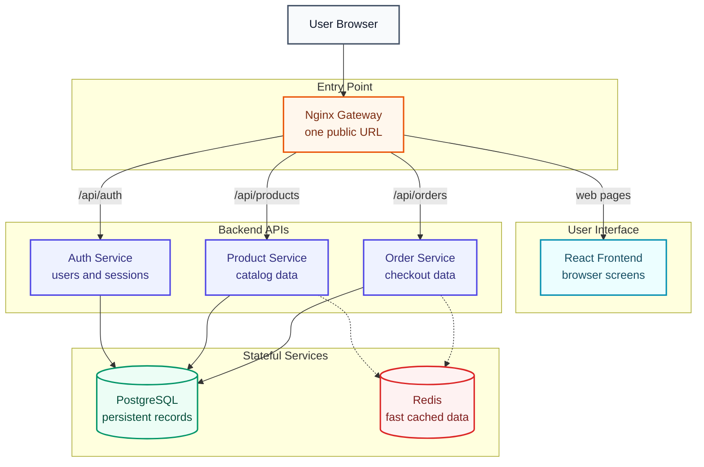
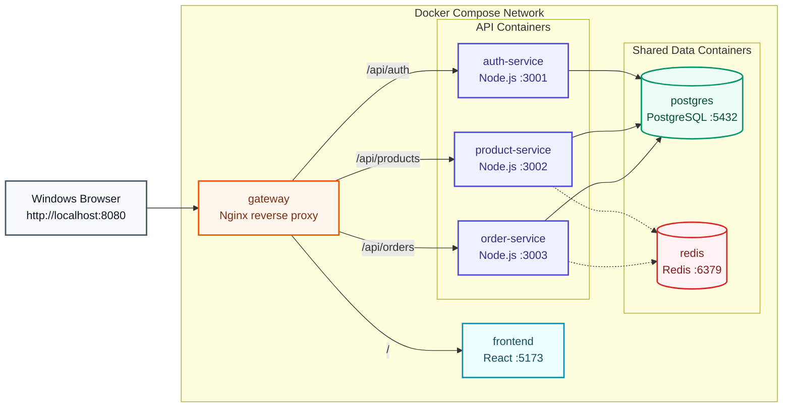
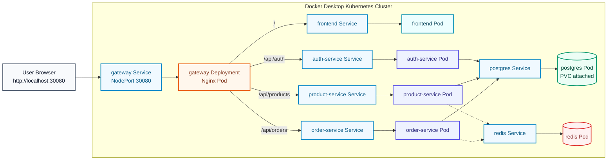
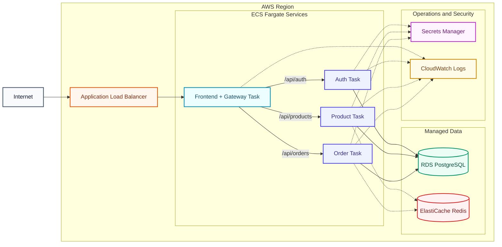

# 🏗️ Architecture

The project is a small e-commerce style microservice system.

## 🧱 Services

| Component | Responsibility |
| --- | --- |
| Frontend | Browser UI built with React |
| Gateway | Nginx reverse proxy and single public entry point |
| Auth Service | User registration, login, and health check |
| Product Service | Product listing and product APIs |
| Order Service | Order creation and order APIs |
| PostgreSQL | Persistent relational data |
| Redis | Fast cache and temporary data |

## System Overview



## 💻 Local Architecture



Important Docker rule:

Inside Docker Compose, containers talk to each other using service names, not `localhost`.

Examples:

```text
DB_HOST=postgres
REDIS_HOST=redis
AUTH_SERVICE_URL=http://auth-service:3001
```

From your Windows browser, you still use `localhost` because the browser is outside Docker:

```text
http://localhost:8080
```

## ☸️ Local Kubernetes Architecture

Docker Desktop Kubernetes uses the same app pieces, but Kubernetes manages them with Deployments and Services.



Important Kubernetes rule:

Pods should talk to other apps through Kubernetes Service names.

Examples:

```text
POSTGRES_HOST=postgres
REDIS_HOST=redis
```

## ☁️ AWS Architecture Later

The AWS version follows the same idea:



The local architecture helps you understand the cloud architecture before you spend money.
